# 🍔 FastFood — Modern Full-Stack Food Delivery Ecosystem

<p align="center">
  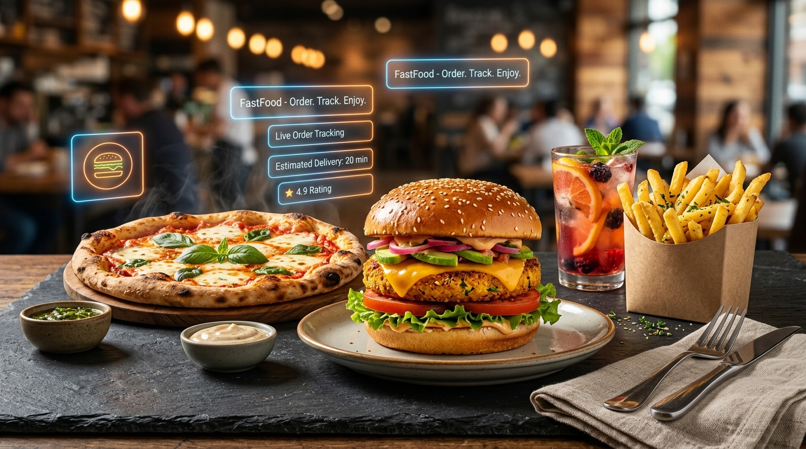
</p>

<p align="center">
  <a href="https://react.dev/"></a>
  <a href="https://vitejs.dev/"></a>
  <a href="https://tailwindcss.com/"></a>
  <a href="https://spring.io/projects/spring-boot"></a>
  <a href="https://www.mysql.com/"></a>
  <a href="https://jwt.io/"></a>
  <a href="https://stomp.github.io/"></a>
  <a href="LICENSE"></a>
</p>

---

## 📌 About FastFood

**FastFood** is a production-grade, multi-tenant food ordering and delivery ecosystem built to bridge **Customers**, **Restaurant Kitchens**, **Delivery Riders**, and **Platform Administrators** in real time.

Rather than a simple front-end prototype, FastFood provides an end-to-end, multi-portal architecture backed by **Spring Boot 3.4**, **MySQL 8**, and **STOMP WebSockets**. Every transaction—from browsing menus and applying coupons to real-time kitchen dispatch and rider geolocation—is persisted, validated, and broadcast live.

### Why FastFood?

- **Real-Time Synergy Across 4 Roles**: Dedicated, customized interfaces for diners, cooks, drivers, and platform operators.
- **Zero Mock Dependencies**: Powered by a robust Spring Boot REST API, Hibernate JPA transactions, and MySQL 8 database schema.
- **Event-Driven Dispatch**: Live bidirectional updates using WebSocket STOMP messaging over SockJS.
- **Stateless & Secure**: Stateless JWT authentication with BCrypt password hashing and granular role authorization.
- **Modern Responsive UX**: Mobile-first design built with **React 19**, **Vite 8**, **Tailwind CSS v4**, and **Zustand** persistence.

### 👤 Author & Maintainer
- **Creator**: [Jaykumar](https://github.com/Jaykumar122)
- **GitHub Repository**: [Jaykumar122/fastfood-website](https://github.com/Jaykumar122/fastfood-website)
- **License**: MIT Open Source

---

## 📸 Application Showcase & Tour

### 1. 🛍️ Customer Storefront & Catalog Discovery
Browse 15+ curated neighborhood restaurants with instant search, cuisine filters, ratings, and dietary preferences.

<p align="center">
  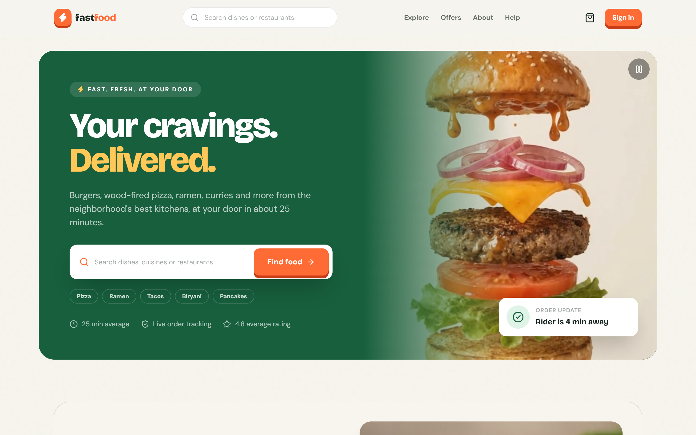
</p>

<p align="center">
  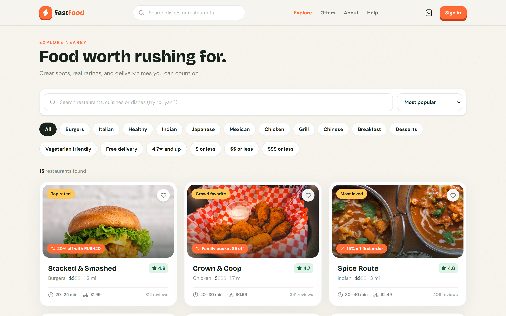
</p>

---

### 2. 🍽️ Restaurant Menus & Interactive 3D Dish View
Explore detailed restaurant menus with categorized dishes, dietary badges, reviews, and a 3D layer-by-layer exploded dish visualizer.

<p align="center">
  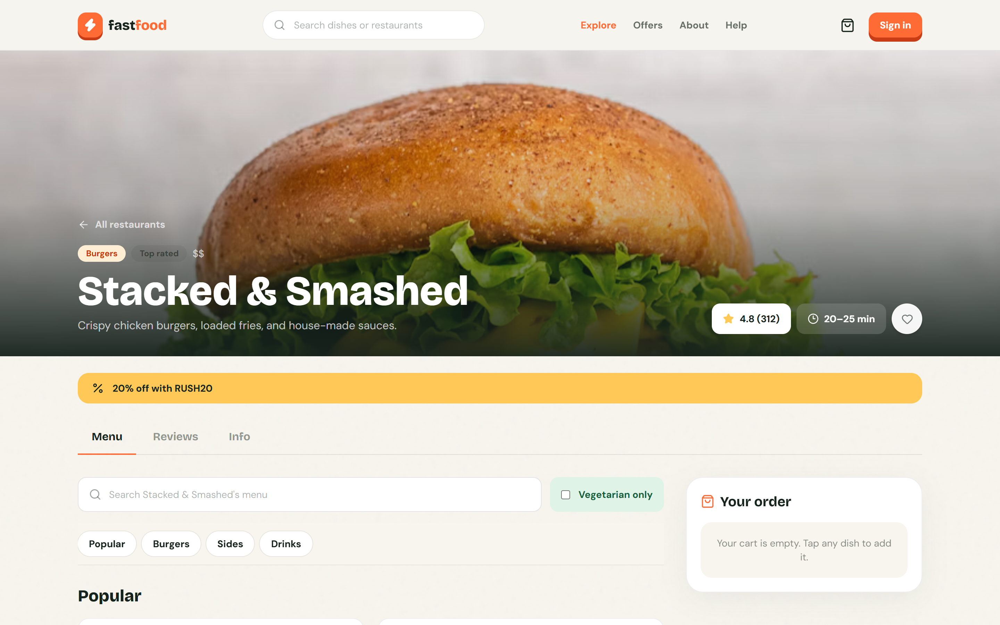
</p>

<p align="center">
  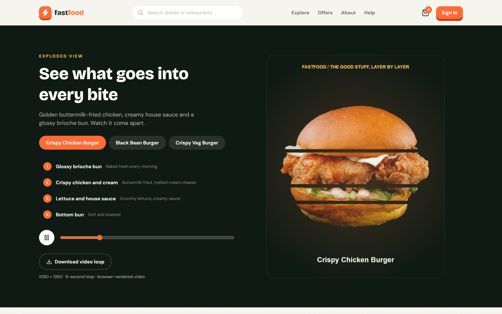
</p>

---

### 3. 🛒 Cart, Promo Codes & Real-Time Order Tracking
Dynamic cart management with automatic free delivery thresholds, promo code engine (`RUSH20`, `WELCOME10`), and real-time STOMP tracking.

<p align="center">
  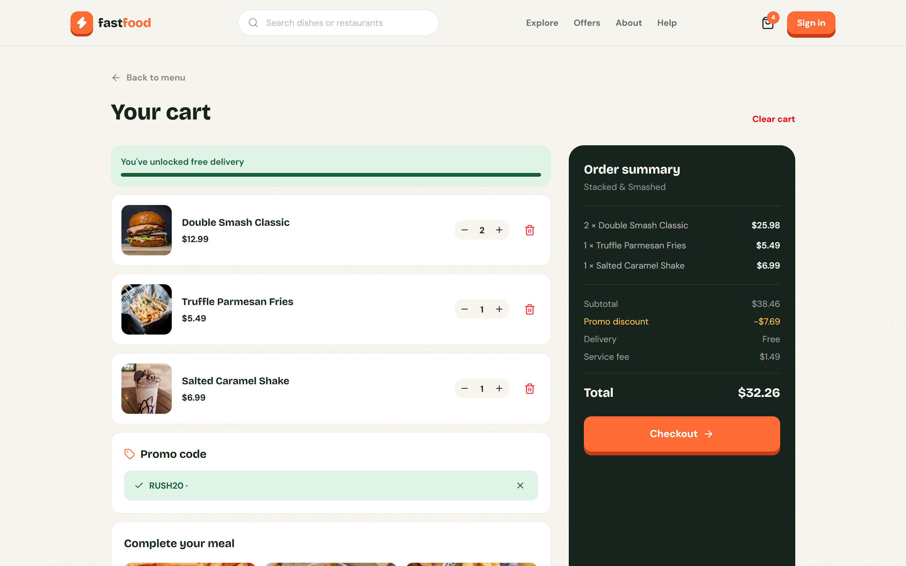
</p>

<p align="center">
  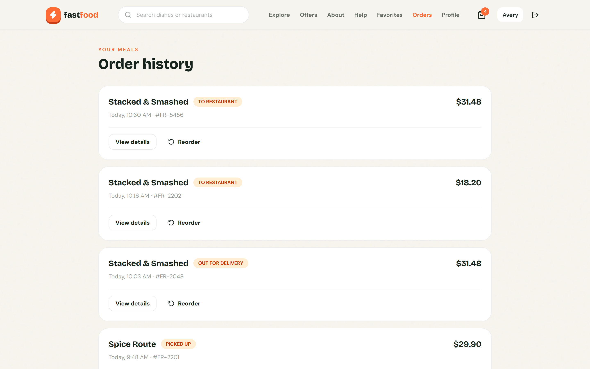
</p>

---

### 4. 👨‍🍳 Restaurant Partner HQ (`/owner`)
Live kitchen dispatch terminal with incoming orders, live menu CRUD, stock availability toggles, and customer review responses.

<p align="center">
  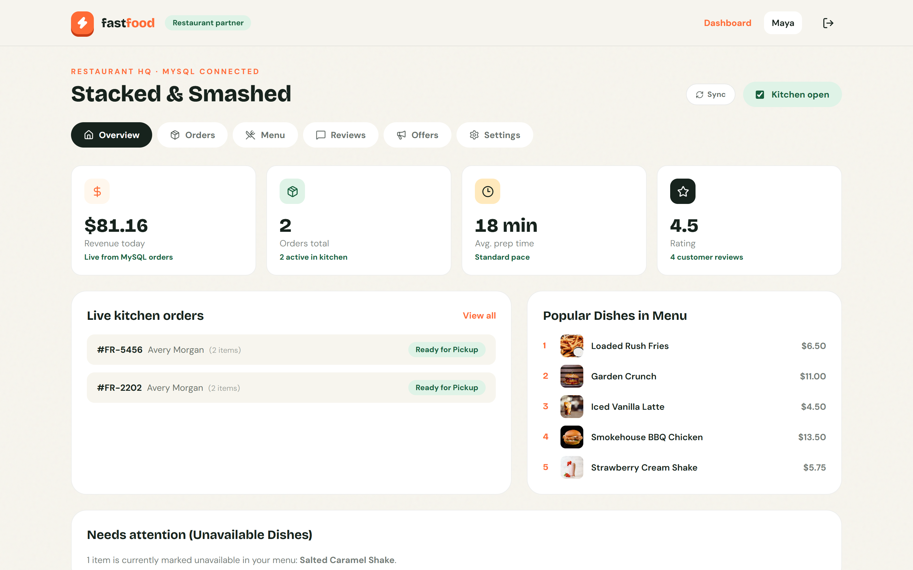
</p>

---

### 5. 🛵 Delivery Rider Hub (`/delivery`)
Real-time dispatch feed with order pool, pickup navigation directions, one-click customer calling, and transparent tip payouts.

<p align="center">
  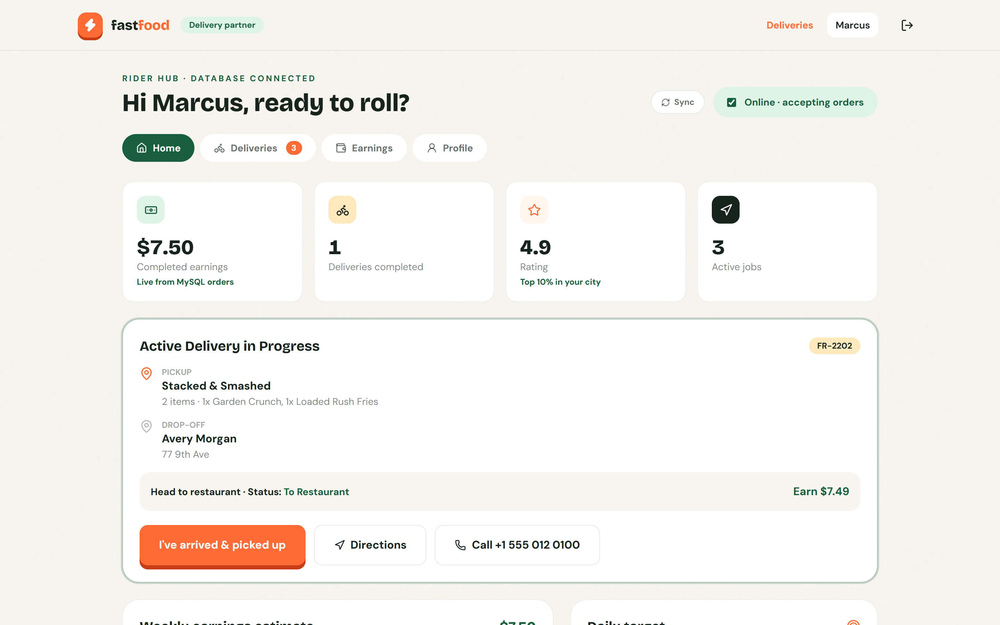
</p>

---

### 6. ⚡ Admin Central Command (`/admin`)
Platform observability cockpit featuring real-time GMV revenue tracking, active order pipeline, merchant compliance verification, and user management.

<p align="center">
  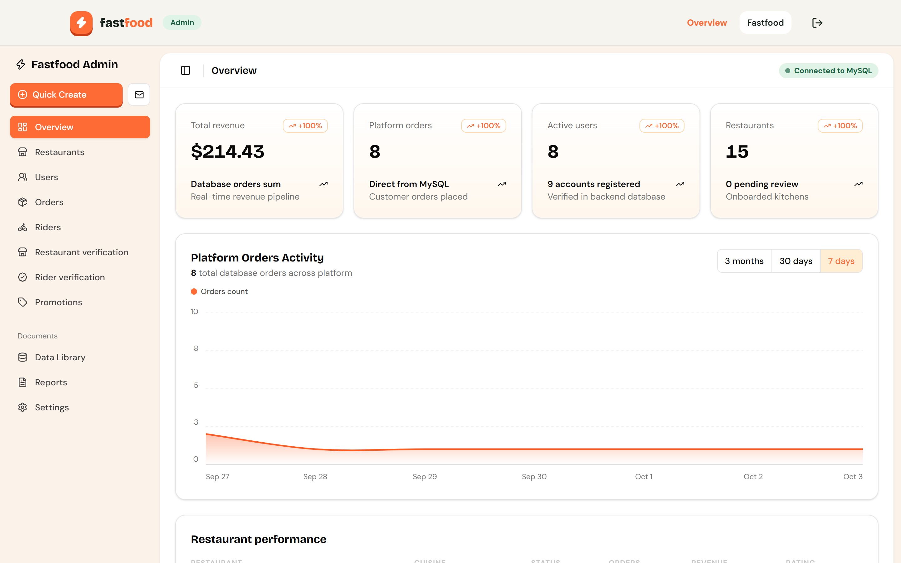
</p>

---

### 7. 🔐 Multi-Role Authentication & About Platform
Unified authentication hub with pre-configured demo quick-logins, plus a dedicated `/about` platform showcase.

<p align="center">
  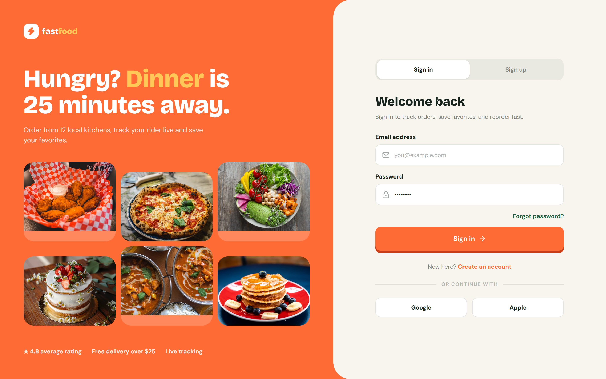
</p>

<p align="center">
  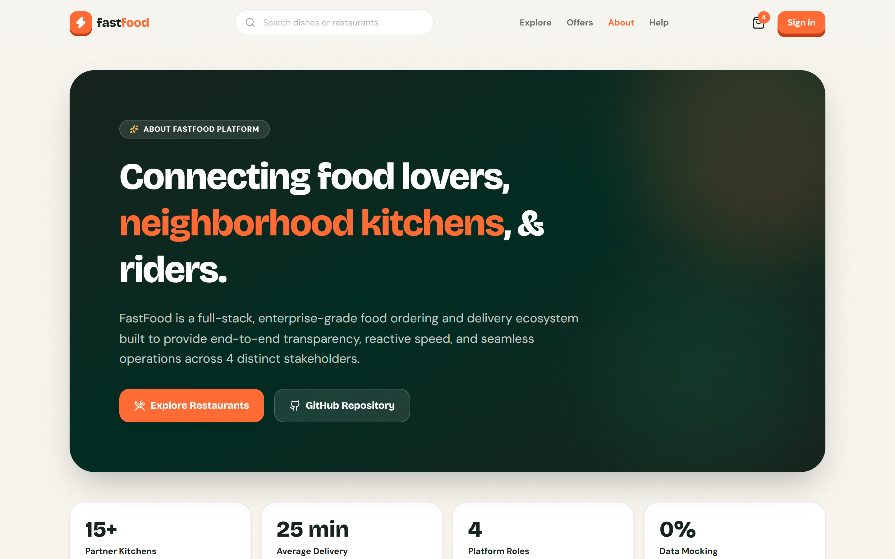
</p>

---

## ✨ System Architecture & Portals

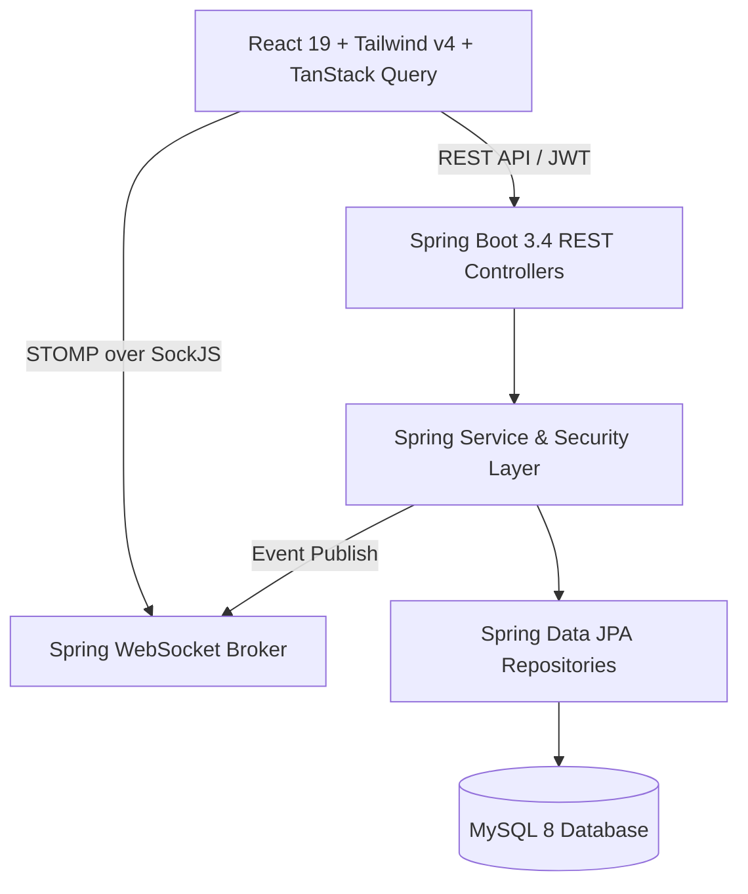

### Portal Overview

| Portal | Route | Primary Capabilities |
| :--- | :--- | :--- |
| **Storefront** | `/` | Restaurant search, cuisine filters, dish customization, cart, promo codes, checkout. |
| **Restaurant HQ** | `/owner` | Real-time order pipeline, dish menu CRUD, stock toggle (in-stock/sold-out), review replies. |
| **Rider Hub** | `/delivery` | Dispatch pool, GPS pickup/drop-off directions, phone shortcuts, earnings ledger. |
| **Admin Command** | `/admin` | Gross revenue KPIs, user suspension/reactivation, compliance document approvals, CSV exports. |
| **Platform About** | `/about` | Architectural philosophy, team info, live metrics, and GitHub repo links. |

---

## 🔐 Demo Accounts & Credentials

All default seed accounts use the default password: `password`

| Portal | URL | Demo Email | Password | Role |
| :--- | :--- | :--- | :--- | :--- |
| **Storefront** | `http://localhost:8443/login` | `customer@fastfood.app` | `password` | `CUSTOMER` |
| **Restaurant HQ** | `http://localhost:8443/restaurant/login` | `owner@fastfood.app` | `password` | `RESTAURANT_OWNER` |
| **Rider Hub** | `http://localhost:8443/delivery/login` | `rider@fastfood.app` | `password` | `DELIVERY_PARTNER` |
| **Admin HQ** | `http://localhost:8443/admin/login` | `admin@fastfood.app` | `password` | `ADMIN` |

---

## 🛠️ Technology Stack

### Frontend
- **Framework**: [React 19](https://react.dev/) + [Vite 8](https://vitejs.dev/)
- **Styling**: [Tailwind CSS v4](https://tailwindcss.com/) with `@tailwindcss/vite`
- **Routing**: [React Router v7](https://reactrouter.com/) with role-based Route Guards
- **State Management**: [Zustand](https://zustand.docs.pmnd.rs/) with `localStorage` persistence
- **Server Cache**: [TanStack Query v5](https://tanstack.com/query)
- **Icons**: [Lucide React](https://lucide.dev/)
- **Realtime Client**: `@stomp/stompjs` + `sockjs-client`

### Backend
- **Framework**: [Spring Boot 3.4](https://spring.io/projects/spring-boot)
- **Language**: Java 21+ / OpenJDK 23
- **Security**: Spring Security 6 with stateless JWT (`io.jsonwebtoken` HS256)
- **Database & ORM**: MySQL 8 + Spring Data JPA / Hibernate ORM
- **Realtime**: Spring WebSocket with STOMP message broker (`/ws`)
- **Build Tool**: Apache Maven 3.9+

---

## 🚀 Getting Started

### Prerequisites
- [Node.js](https://nodejs.org/) (v18.0.0 or higher)
- [Java Development Kit (JDK)](https://adoptium.net/) (v21 or v23)
- [Apache Maven](https://maven.apache.org/) (v3.9+)
- [MySQL Server 8](https://dev.mysql.com/downloads/installer/)

---

### 1. Database Setup & Security Configuration

Create the MySQL database:

```sql
CREATE DATABASE IF NOT EXISTS fastfood_db CHARACTER SET utf8mb4 COLLATE utf8mb4_unicode_ci;
```

> [!IMPORTANT]
> **Database Credentials Security**: Never hardcode or commit database root passwords to version control. Pass your database password securely using environment variables or a local untracked configuration file.

#### Configure Database Credentials via Environment Variable:

**Windows (PowerShell):**
```powershell
$env:DB_USERNAME="root"
$env:DB_PASSWORD="your_mysql_password"
```

**macOS / Linux (Bash):**
```bash
export DB_USERNAME="root"
export DB_PASSWORD="your_mysql_password"
```

---

### 2. Backend Launch

1. Navigate to the backend directory:
   ```bash
   cd backend
   ```

2. Run the Spring Boot application (reads `DB_PASSWORD` from environment):
   ```bash
   mvn spring-boot:run
   ```
   *The backend starts on `http://localhost:8081`. Database tables and initial seed data are populated automatically.*

---

### 3. Frontend Launch

1. Navigate to the frontend directory:
   ```bash
   cd front-end
   ```

2. Install dependencies:
   ```bash
   npm install
   ```

3. Start the Vite development server:
   ```bash
   npm run dev
   ```
   *Open your browser and navigate to `http://localhost:8443`.*

---

## 📡 API Reference Summary

Base URL: `http://localhost:8081/api`

### Authentication (`/api/auth`)
- `POST /api/auth/login` — Authenticate user and return JWT bearer token.
- `POST /api/auth/register` — Register customer, owner, or rider account.

### Restaurants & Menus (`/api/restaurants`)
- `GET /api/restaurants` — Search and filter approved restaurants.
- `GET /api/restaurants/{id}` — Retrieve restaurant details.
- `GET /api/restaurants/{id}/menu` — List menu items for a restaurant.
- `POST /api/restaurants/menu-items` — Create a new dish *(Owner/Admin)*.
- `PUT /api/restaurants/menu-items/{id}` — Update dish details or stock status *(Owner/Admin)*.
- `DELETE /api/restaurants/menu-items/{id}` — Delete a dish *(Owner/Admin)*.
- `GET /api/restaurants/{id}/reviews` — Retrieve customer reviews.

### Orders (`/api/orders`)
- `POST /api/orders` — Place customer order.
- `GET /api/orders/my` — Customer order history.
- `GET /api/orders/restaurant` — Restaurant kitchen queue or Admin platform orders.
- `GET /api/orders/{id}` — Order status and tracking breakdown.
- `PUT /api/orders/{id}/status` — Advance order state (`PREPARING`, `TO_RESTAURANT`, `CANCELLED`).

### Delivery (`/api/delivery`)
- `GET /api/delivery/available` — Unassigned orders waiting for pickup.
- `GET /api/delivery/assigned` — Currently assigned active jobs for the authenticated rider.
- `GET /api/delivery/history` — Completed deliveries for the rider.
- `PUT /api/delivery/{id}/status` — Update delivery status (`TO_RESTAURANT`, `PICKED_UP`, `DELIVERED`).

### Admin (`/api/admin`)
- `GET /api/admin/users` — List platform users across all roles.
- `PUT /api/admin/restaurants/{id}/approve` — Approve pending restaurant application.

---

## 📂 Project Structure

```
foodwebsite/
├── docs/
│   └── images/
│       ├── banner.jpg                      # Hero banner
│       ├── 01-storefront-hero.png          # Storefront showcase
│       ├── 02-restaurant-catalog.png       # Restaurant catalog & filters
│       ├── 03-restaurant-menu.png          # Restaurant menu & dishes
│       ├── 04-cart-and-promos.png          # Shopping cart & promo engine
│       ├── 05-3d-sandwich-showcase.png     # 3D exploded dish visualizer
│       ├── 06-about-fastfood.png           # About page showcase
│       ├── 07-multi-portal-auth.png        # Authentication hub
│       ├── 08-restaurant-kitchen-dashboard.png # Kitchen dispatch terminal
│       ├── 09-delivery-rider-hub.png       # Rider dispatch & earnings
│       ├── 10-admin-command-center.png     # Admin analytics & governance
│       └── 11-customer-orders.png          # Real-time order tracking
├── backend/
│   ├── db/
│   │   └── setup.sql                       # MySQL initialization script
│   ├── src/main/java/com/fastfood/
│   │   ├── config/                         # Security, CORS, WebSocket STOMP & Seeder
│   │   ├── domain/                         # JPA Entities (User, Restaurant, Order, MenuItem)
│   │   ├── dto/                            # Request & Response records
│   │   ├── repository/                     # Spring Data JPA Repositories
│   │   ├── service/                        # Business logic & JWT services
│   │   └── web/                            # REST API Controllers
│   └── pom.xml                             # Maven dependencies
├── front-end/
│   ├── src/
│   │   ├── api/                            # Axios client, endpoints map, service functions
│   │   ├── components/                     # Reusable UI, AppShell, StaffShell, Navbar
│   │   ├── pages/                          # Page views (Storefront, Owner, Rider, Admin, About)
│   │   ├── routes/                         # Route configuration and authentication guards
│   │   ├── store/                          # Zustand stores (auth, cart, application, profile)
│   │   └── App.jsx                         # Router provider entry
│   ├── index.html                          # HTML entry point
│   ├── package.json                        # Frontend dependencies
│   └── vite.config.ts                      # Vite & Tailwind configuration
├── .gitignore                              # Git ignore rules (protects credentials)
└── README.md                               # Project documentation
```

---

## 📄 License

This project is licensed under the [MIT License](LICENSE) — created by [Jaykumar](https://github.com/Jaykumar122).
